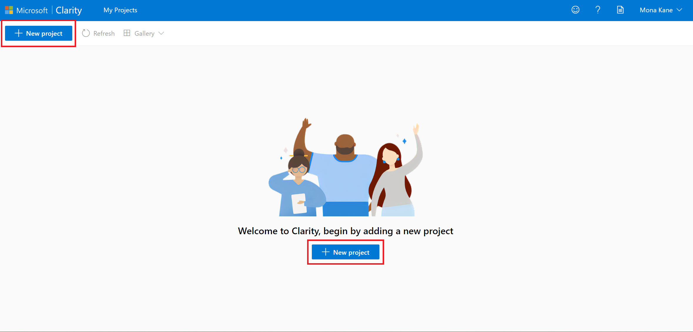
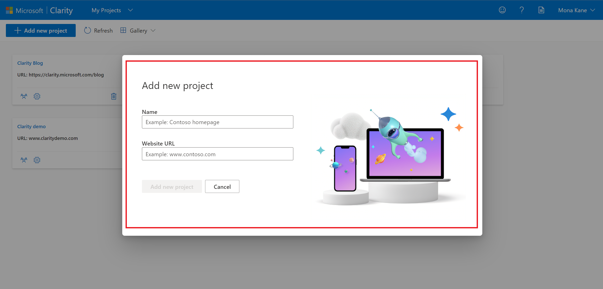
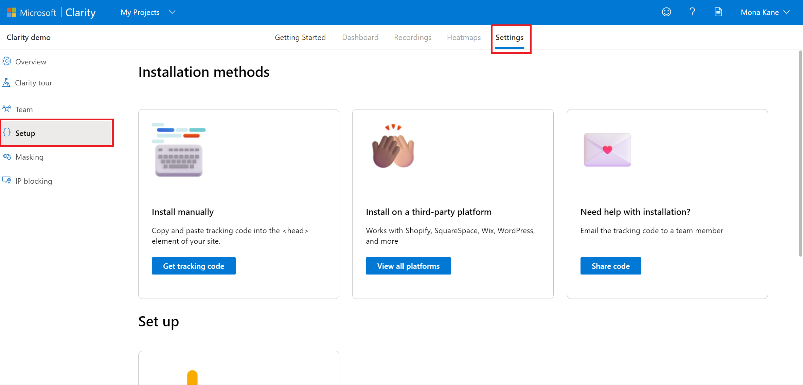
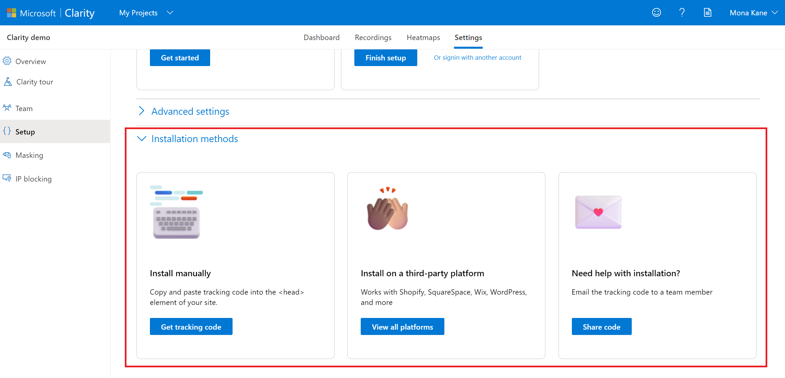
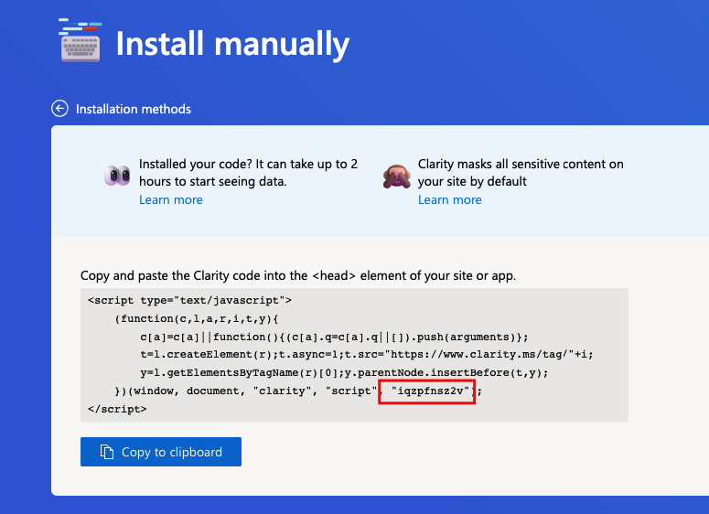
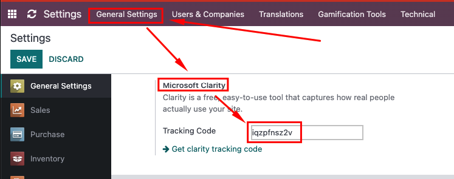
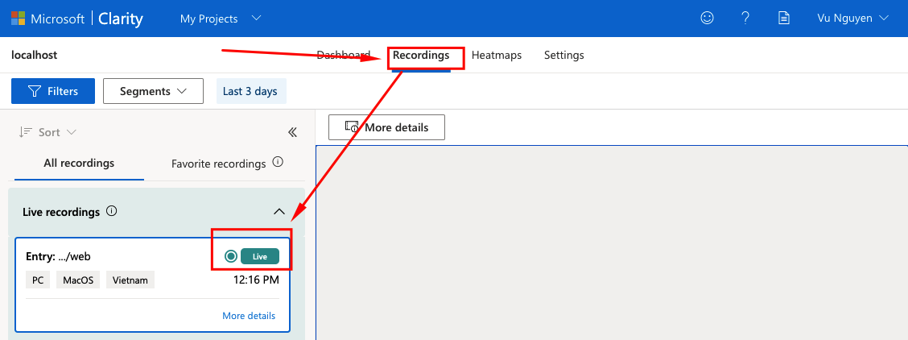

# Odoo - Microsoft Clarity

## Add a Project

1. Sign in to your [Clarity](https://clarity.microsoft.com/) account.

2. Select 'New project' to start adding a project.

  

4. Enter the Name and Website details. Select Add new project once done.

  

## Install tracking code

1. Select a project and go to Settings -> Setup

  

2. Choose get Tracking Code

  

3. Get tracking code

  

4. Copy tracking code to Setting -> General Setting -> Integrations -> Microsoft Clarity.

  

5. Reviewing your recording video on [https://clarity.microsoft.com/projects](https://clarity.microsoft.com/projects)

  

## Credits

Authors

* Vu Nguyen

Contributors

* Vu Nguyen <vuna2004@gmail.com>
